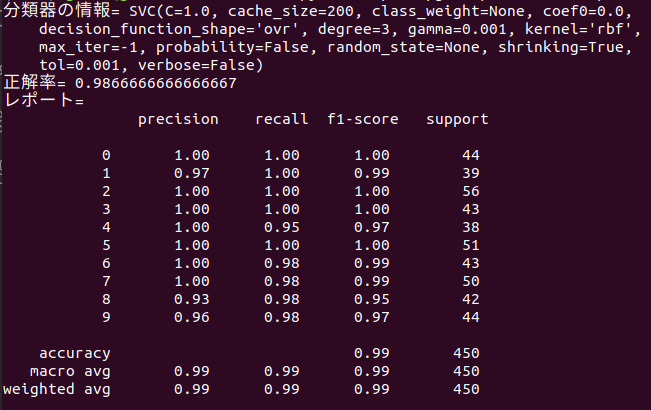
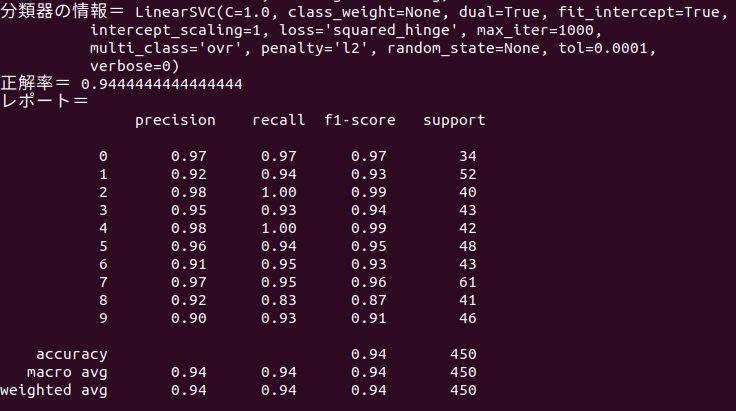
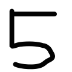
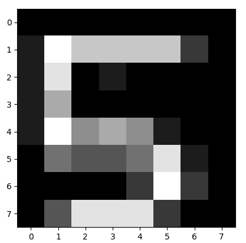
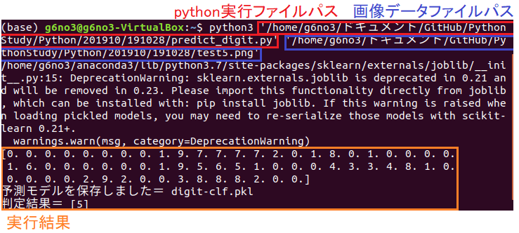
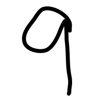
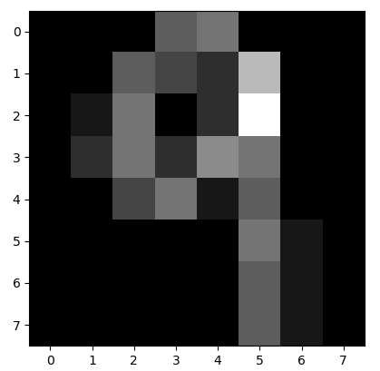
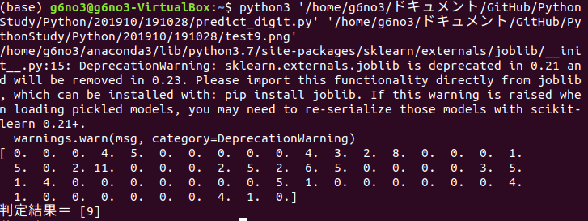

## Scikit learnではじめる機械学習
* 定義済み学習データを利用
```
# Scikit learnのサンプル学習データを取り込む
from sklearn import datasets

# 手書き数字データを読み込む
digits = datasets.load_digits()
digits.images.shape # (1797,8,8) 手書きの数字データが1797件

# 0番目のデータ-どの数字か
digits.target[0]

# 0番目のピクセルデータ
digits.images[0]
```
<dl>
 <dt>targetプロパティ</dt>
 <dd>どの数字かを表すラベル情報のリスト</dd>
 <dt>imagesプロパティ</dt>
 <dd>ピクセルデータ(グレースケールの8x8ピクセル　16階調 0:薄い⇔15:濃い)</dd>
</dl>

```
# Scikit learnのサンプル学習データを取り込む
from sklearn import datasets

# 描画のためにmatplotlibモジュールを取り込む
from matplotlib import pyplot as plt, cm

# 手書き数字データを読み込む
digits = datasets.load_digits()
data = digits.images[0]

# 描画
plt.imshow(data.reshape(8,8),cmap=cm.gray_r,interpolation="nearest")
plt.show()
```
<dl>
 <dt>matplotlibモジュール</dt>
 <dd>データの描画</dd>
</dl>

## 手書き数字認識
* **SVM**アルゴリズムを利用して機械学習
<dl>
 <dd>precision:精度、recall:再現率（実際に正解した割合）、fl-score:精度と再現率の調和平均、support:正解ラベルのデータ数</dd>
 <dt>precisionとrecallの違いは計算方法の違い</dt> 
 <dd>どちらも予測が正しいことの指標 </dd>
 <dd>モデルの判定結果が真かつ実際に正しい値を判定：True Positive(TP) 誤り：False Positive(FP)</dd>
 <dd>モデルの判定結果が偽かつ実際の値が真（予測と違う値）：False Negative(TN) 実際の値も偽：True Negative(TN)</dd>
 <dt>precision(適合率)の計算</dt>
 <dd>TP / (TP + FP)</dd>
 <dt>recall(再現率)の計算</dt>
 <dd>TP / (TP + FN)</dd>
</dl>

 |   |実際の値が真|実際の値が偽|
 |------------|-----------------|------------------|
 |判定結果が真|True Positive(TP)|False Positive(FP)|
 |判定結果が偽|False Negative(TN)|True Negative(TN)|

```
from sklearn import datasets,svm, metrics
from sklearn.model_selection import train_test_split

# 手書き数字データを読み込む
digits = datasets.load_digits()

# 訓練用データとテスト用データに分ける
data_train, data_test, label_train, label_test = \
    train_test_split(digits.data, digits.target)
    
# SVMアルゴリズムを利用してモデルを構築する
clf = svm.SVC(gamma=0.001)
clf.fit(data_train,label_train)

# テストデータでの分析結果予測してみる
predict = clf.predict(data_test)

# 結果を表示する
ac_score = metrics.accuracy_score(label_test,predict)
cl_report = metrics.classification_report(label_test,predict)
print("分類器の情報＝",clf)
print("正解率＝",ac_score)
print("レポート＝\n",cl_report)
```
<dl>
 <dt>train_test_split(digits.data, digits.target)</dt>
 <dd>指定されたデータをランダムに訓練用とテスト用のデータに分ける。</dd>
 <dd>手書き画像データ(digits.data)とラベルデータ(digits.target)を入力し、訓練用とテスト用のデータとラベルを出力</dd>
 <dt>svm.SVC(gamma=0.001)</dt>
 <dd>SVMアルゴリズムのSVCクラスを用いて分類。引数にパラメータを指定</dd>
 <dd>SVMには、SVC/LinearSVC/NuSVCなどの種類があり、SVCは標準的実装。LinearSVCは線形カーネルに特化し、高速に計算ができる。種類によって実行速度や判定精度が変わる</dd>
 <dd>引数のパラメータ：&nbsp;ガンマ値(gamma=)&emsp;ソフトマージンのコストパラメータを表す(C)など指定できる</dd>
 <dt>clf.fit(data_train,label_train)</dt>
 <dd>fit()メソッドの第一引数は訓練データの本体、第二引数は訓練データに対するラベルを指定して学習させる。</dd>
 <dt>clf.predict(data_test)</dt>
 <dd>predict()メソッドで学習済みモデルを元に、テストデータの分類を予測する。</dd>
</dl>

<div style="text-align: center;width: 100%;">

<div style="white-space: pre;">[SVC(gamma=0.001)の実行結果]</div>
</div>
<br>
<div style="text-align: center;width: 100%;">

<div style="white-space: pre;">[LinearSVC()の実行結果]</div>
</div>

## 手書き数字の画像を認識 
* コマンドラインで手書き数字の画像ファイルを指定すると、画像内に書かれている数字を認識するプログラム。
```
import os, sys, math
from sklearn import datasets, svm
from sklearn.externals import joblib

# モデルデータファイル名
DIGITS_PKL = "digit-clf.pkl"

# 予測モデルを作成する
def train_digits():
    # 手書き数字データを読み込む
    digits = datasets.load_digits()
    # 訓練する
    data_train = digits.data
    label_train = digits.target
    clf = svm.SVC(gamma=0.001)
    clf.fit(data_train,label_train)
    # 予測モデルを保存
    joblib.dump(clf,DIGITS_PKL)
    print("予測モデルを保存しました＝",DIGITS_PKL)
    return clf

# データから数字を予測する
def predict_digits(data):
    # モデルファイルを読み込む
    if not os.path.exists(DIGITS_PKL):
        clf = train_digits() # モデルがなけれは生成
    clf = joblib.load(DIGITS_PKL)
    # 予測
    n = clf.predict([data])
    print("判定結果＝", n)
    
# 手書き数字画像を8ｘ8グレイスケールのデータ配列に変換
def image_to_data(imagefile):
    import numpy as np
    from PIL import Image
    image = Image.open(imagefile).convert('L')
    image = image.resize((8,8),Image.ANTIALIAS)
    img = np.asarray(image, dtype=float)
    img = np.floor(16 - 16 * (img / 256)) # 行列演算
    # 変換後の画像を表示
    import matplotlib.pyplot as plt
    plt.imshow(img)
    plt.gray()
    plt.show()
    
    img = img.flatten()
    print(img)
    return img

def main():
    # コマンドライン引数を得る
    if len(sys.argv) <= 1:
        print("USAGE:")
        print("python3 predict_digit.py imagefile")
        return
    imagefile = sys.argv[1]
    data = image_to_data(imagefile)
    predict_digits(data)
    
if __name__ == "__main__":
    main()    
```
<dl>
 <dt>joblib.dump(clf,DIGITS_PKL)</dt>
 <dd>Scikit learnのサンプル手書きデータから生成した予測モデルをファイルに保存する。
 <br>(保存先はカレントディレクトリ　Linuxコマンド【 pwd 】現在の作業ディレクトリを表示 )</dd>
 <dt>Scikit learnのサンプル手書きデータ形式(numpy.ndarray型)</dt>
 <dd>画像の左上から右下へ8x8ピクセル（合計64個の実数を持つ）型に、画像ファイルを変換する必要がある。</dd>  
 <dt>＜PILモジュール＞</dt>
 <dd>画像ファイルの読み込みに利用。</dd>
 <dt>Image.open(imagefile).convert('L')</dt>
 <dd>PILモジュールのImage.open(imagefile)メソッドで画像を読み込む。</dd>
 <dd>convert('L')メソッドで画像をグレースケールに変換する。</dd>
 <dt>image.resize((8,8),Image.ANTIALIAS)</dt>
 <dd>画像を8ｘ8ピクセルにリサイズする。</dd>
 <dt>＜numpyモジュール＞</dt>
 <dd>数値計算を効率的に行うための拡張モジュール。</dd>
 <dd>Pythonのリストデータは、大量のデータを扱う際には非効率だが、numpyでは、より効率的な処理を行うためのものが用意されている。</dd>
 <dt>np.asarray(image, dtype=float)</dt>
 <dd>np.asarray(image, dtype=float)メソッドで変換した画像データをnumpy.ndarray型に変換する。</dd>
 <dt>多次元配列（ndarray）に対する行列計算</dt>
 <dd>Scikit learnのサンプル手書きデータは、0(薄い)〜15(濃い)の16段階データ。</dd>
 <dd>変換したグレースケールの画像データは、0(黒)〜255(白)の256段階データなので、1つ1つのピクセルに対して計算処理を行う。</dd>
 <dd>img = np.floor(16 - 16 * (img / 256))</dd>
 <dd>img変数に対して1回だけ計算しているように見えるが、imgは多次元配列（ndarray）なので、全要素に対して演算が行われる。</dd>
</dl>

<figure class="gazo-box">
<div style="text-align: center;width: 100%;">


<figcaption>左：手書き数字の画像　右：8Ｘ8ピクセル変換画像</figcaption>
<br>

<div style="white-space: pre;">[コマンドラインでのプログラム実行結果]</div>
</div>
<br>
<figure class="gazo2-box">
<div style="text-align: center;width: 100%;">


<figcaption>左：手書き数字の画像　右：8Ｘ8ピクセル変換画像</figcaption>
<br>

<div style="white-space: pre;">[コマンドラインでのプログラム実行結果]</div>
</div>