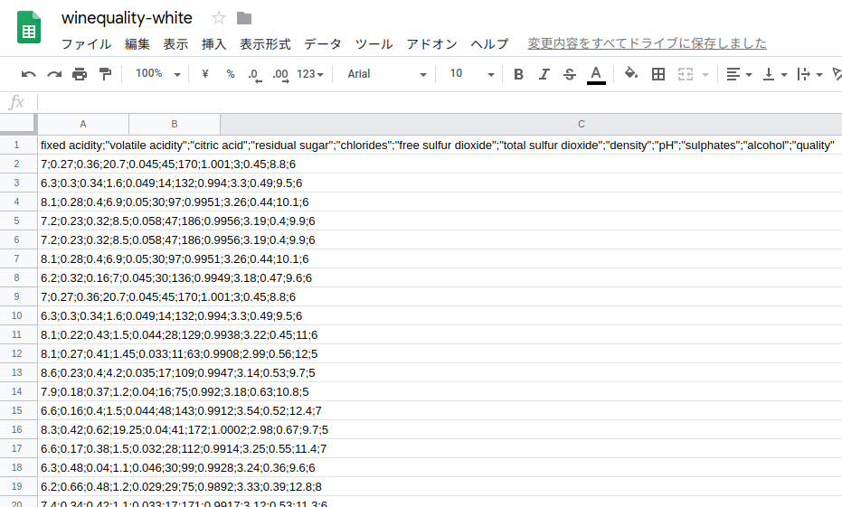
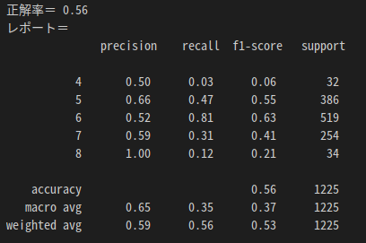

## 機械学習でワインの美味しさを判定
* UCI機械学習リポジトリ
<dl> 
 <dd>機械学習では、どのようにしてデータを収集するのかが大きな課題。
 <br>機械学習に使えるデータを収集し公開している「UCI機械学習リポジトリ」からワインに関するデータをダウンロード</dd>
</dl>

[UCI機械学習リポジトリ > Wine Quality Data Set](http://archive.ics.uci.edu/ml/datasets/Wine+Quality)

<div style="text-align: center;width: 100%;">

<div style="white-space: pre;">[winequality-white.csv]</div>
</div>
<dl>
 <dt>csvファイルのフィールド一覧</dt>
 <dd>1列目から11列目がワインの成分
 <br>12列目が専門家の評価 (0まずい〜10美味しい)</dd>
</dl>

#### 機械学習ライブラリ「scikit-learn」で学習器にデータを学習させる場合

<dl>
 <dt>データの配列とラベルの配列を分けておく必要がある</dt>
 <dd>データ（1列目から11列目がワインの成分）
 <br>ラベル（12列目が専門家の評価）</dd>
</dl>

```
from sklearn import svm,metrics
from sklearn.model_selection import train_test_split

# ワインデータ(CSV)を読み込む
wine_csv = []
with open("/home/g6no3/winequality-white.csv","r",encoding="utf-8") as fp:
    no = 0
    for line in fp:
        line = line.strip()
        cols = line.split(";")
        wine_csv.append(cols)
        
# 1行目はヘッダ行なので削除
wine_csv = wine_csv[1:]

# CSVの各データを数値に変換
labels = []
data = []
for cols in wine_csv:
    cols = list(map(lambda n: float(n), cols))
    # ワインのグレードを調整
    grade = int(cols[11]) # 末尾のデータがワインのグレード
    # 少なすぎるサンプルを調整
    if grade == 9:
        grade = 8
    if grade < 4:
        grade = 5
    labels.append(grade)
    data.append(cols[0:11]) # ワインの成分データ
    
# 訓練データとテスト用データに分ける
data_train,data_test,label_train,label_test = \
    train_test_split(data,labels)
    
# SVMのアルゴリズムを利用して学習
clf = svm.SVC()
clf.fit(data_train,label_train)

# 予測してみる
predict = clf.predict(data_test)

# 結果を表示する
as_score = metrics.accuracy_score(label_test,predict)
cl_report = metrics.classification_report(label_test,predict)
print("正解率＝",as_score)
print("レポート＝\n",cl_report)
```

<dl>
 <dt>csvファイルの読み込み</dt> 
 <dd>csvファイルを扱うモジュールがあるが、今回はファイルを読み込み、自力で解析する。</dd>
 <dd>open()でファイルを開き、for構文で1行ずつデータを読み込む。<br>
 （csvファイルは1行が1レコードとなっているため）</dd>
 <dt>str.strip([文字集合])</dt>
 <dd>先頭と末尾にある文字集合を削除したものを返す。文字集合を省略すると空白文字を削除。</dd>
 <dt>str.split(区切り文字[,回数])</dt>
 <dd>文字列を区切り文字で分割する。</dd>
 <dt>文字列のスライス</dt>
 <dd>wine_csv[1:],cols[0:11]</dd>
 <dd>その他記述<br>先頭略n[:5],　後ろから指定n[-3:],　stepずつn[0:9:2]</dd>
 <dt>floatに変換</dt>
 <dd>csvを二次元リストに変換しただけでは、各値はstr型なので、float（）で数値に変換する。</dd>
 <dt>map(function,iterable)関数</dt>
 <dd>第一引数の関数を、第二引数のリストの要素全てに対して適用し、結果を返す。</dd>
 <dt>ワインのグレード調整</dt>
 <dd>実際のデータには、3〜9のグレードしか無く、グレード3，4，9の値は非常に少ないデータしか存在しない。<br>
 そのまま学習させると、データが少なすぎるエラーが出るので修正。</dd>
</dl>

<div style="text-align: center;width: 100%;">

<div style="white-space: pre;">[実行結果]</div>
</div>

### チューニング
<dl>
 <dd>正解率の精度が55％で、良い正解率ではないのでチューニングが必要</dd>
 <dt>ランダムフォレストのアルゴリズム</dt>
 <dd>SVMのアルゴリズムで分類したが、精度の高いことで有名なランダムフォレストのアルゴリズムに変更</dd>
 <dd>scikit-learnでは、アルゴリズムを変更しても、データの訓練はfit()メソッド、データの予測はpredict()メソッドと、APIが統一されている。</dd>
</dl>
* 